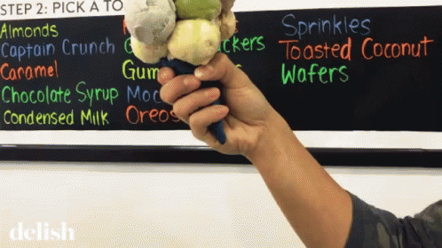

# $${\color{cyan} Hello!\ I'm\ Gus\ 👋\}$$

  
 

<h3>$${\color{cyan}📊\ My\ Github\ Stats\ }$$</h3>

 <!-- https://github.com/DenverCoder1/github-readme-streak-stats -->
 <!-- https://github.com/anuraghazra/github-readme-stats -->

- 🍦 Fun Fact: My academic life started in a very different direction, my first semester in university was in Civil Engineering degree, but I realized that it wasn't for me, at least I learned to balance a huge pot of dessert! 😂

- 📫 How to reach me **github-contact@gustavostz.com**

 

<h3 align="left">Connect with me:</h3>

